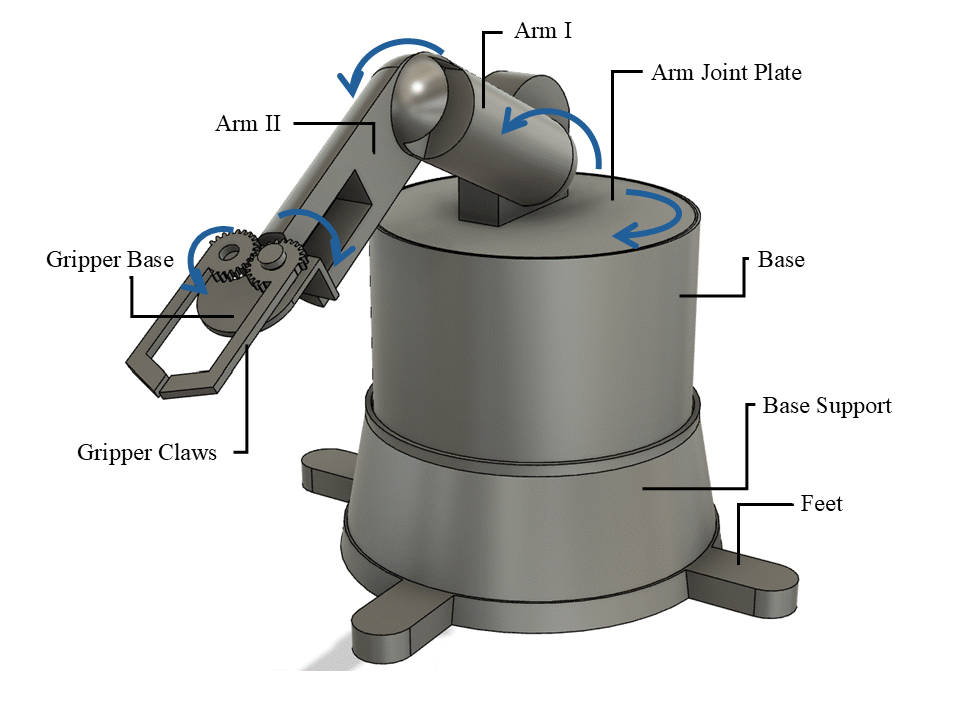
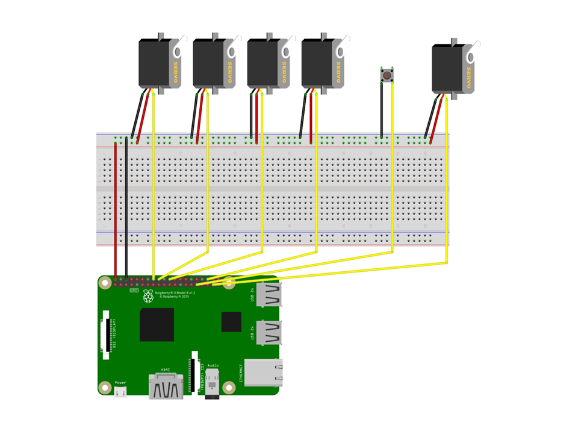
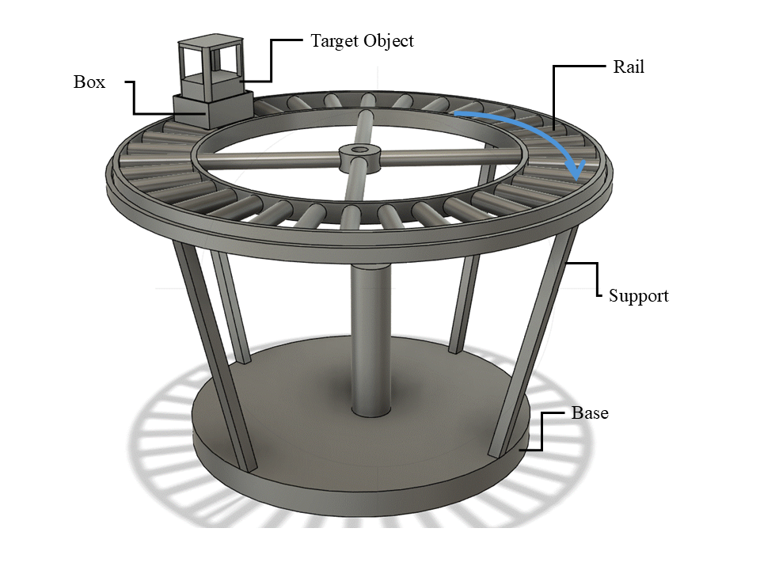
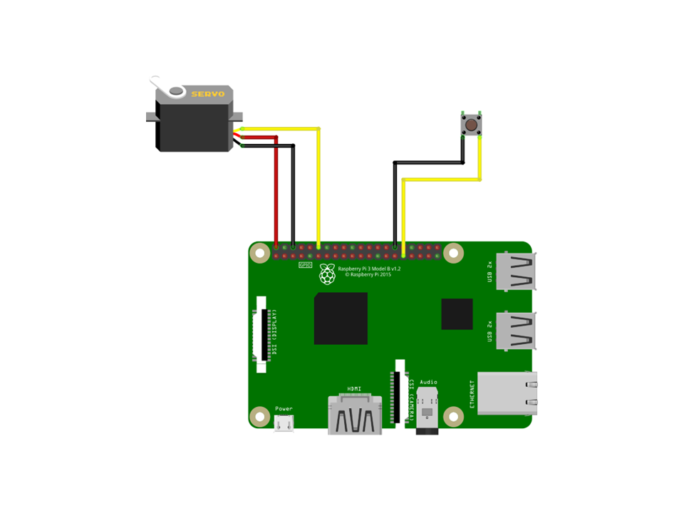

# OPC UA Controlled Cobot and Conveyor System

This project features a 3D-printable 6-axis collaborative robot (Cobot) and a conveyor belt system, both designed to be controlled remotely via OPC UA servers running on Raspberry Pi. The system is a complete mechatronics project, including 3D CAD models, electronic circuit diagrams, and Python control scripts.

> **Note:** This project is designed to be tested with the OPC UA Fusion application available at [roshbeng/opcua_fusion](https://github.com/roshbeng/opcua_fusion.git). This client provides a user interface to connect to the servers and execute the defined methods.

## Features

*   **Remote Control:** Utilizes the OPC UA protocol for robust and standardized industrial communication.
*   **Raspberry Pi Based:** The control logic runs on Raspberry Pi, leveraging its GPIO capabilities to drive servo motors.
*   **Complete Design Files:** Includes comprehensive CAD models in various formats (`.f3d`, `.step`, `.ipt`, `.pdf`) for both the cobot and the conveyor.
*   **Asynchronous Operation:** Built with Python's `asyncio` and the `asyncua` library for efficient, non-blocking server operation.
*   **Hardware Control:** Directly interfaces with servo motors for physical movement and includes a physical shutdown button for safety.
*   **Modular:** The cobot and conveyor operate as separate, independent systems, each with its own OPC UA server.

## Project Structure

```
.
├── requirements.txt
├── CAD models
│   ├── cobot_model
│   │   ├── cobot individual components in step format
│   │   └── cobot_model_v1_inventor
│   └── conveyor_model
│       ├── conveyor individual components in step format
│       └── conveyor_model_v1
├── opcuaprojectcobot
│   ├── cobot_model_3d_cad_design.png
│   ├── the_electronic_circuit_of_the_cobot_model.PNG
│   ├── opcua_cobot_server.py
│   ├── initialze.py
│   ├── robo_arm_without_opc.py
│   └── shutdownbutton.py
└── opcuaprojectconveyor
    ├── conveyor_model_3d_cad_design.png
    ├── the_electronic_circuit_of_the_conveyor_model.PNG
    ├── opcua_conveyor_server.py
    └── shutdownbutton.py
```

## 1. Collaborative Robot (Cobot)

The cobot is a 6-axis robotic arm designed for pick-and-place operations. It is controlled by five servo motors for its joints and one for the gripper.



### Cobot Electronics

The cobot is controlled by a Raspberry Pi connected to six servo motors and a physical shutdown button.



### Cobot OPC UA Server (`opcua_cobot_server.py`)

This script creates an OPC UA server on a Raspberry Pi to expose control methods for the cobot.

*   **Endpoint:** `opc.tcp://192.168.1.3:4840/cobot_arm`
*   **GPIO Pins Used:**
    *   Servos: `16`, `25`, `23`, `24`, `26`
    *   Shutdown Button: `6`
*   **OPC UA Methods:**
    *   `move_arm(command_bool)`: Executes a pre-programmed sequence of movements. Returns `True` on completion.
    *   `reference_cobot()`: Moves the cobot to a home/reference position. Returns `True`.
    *   `stop_cobot()`: Stops all servos and initiates a system shutdown of the Raspberry Pi.
*   **OPC UA Variables & Properties:**
    *   `claw_position`: A variable to hold the gripper's position (not fully implemented in the provided script).
    *   `server_timestamp`: A variable that updates every second with the current server time.
    *   `Manufacturer`: "HomeBuiltCobot"
    *   `Version`: "1.0"

## 2. Conveyor System

A simple conveyor system designed to transport parts. It is driven by a single continuous rotation servo motor.



### Conveyor Electronics

The conveyor is controlled by a separate Raspberry Pi, connected to one servo and a shutdown button.



### Conveyor OPC UA Server (`opcua_conveyor_server.py`)

This script creates an OPC UA server to control the conveyor motor.

*   **Endpoint:** `opc.tcp://192.168.1.2:4840/conveyor`
*   **GPIO Pins Used:**
    *   Servo: `18`
    *   Shutdown Button: `6`
*   **OPC UA Methods:**
    *   `initialize()`: Moves the conveyor to an initial/home position. Returns `True`.
    *   `move_and_supply()`: Runs the conveyor motor to transport items. Returns `True`.
*   **OPC UA Variables & Properties:**
    *   `server_timestamp`: A variable that updates every second with the current server time.
    *   `Manufacturer`: "HomeBuiltConveyor"
    *   `Version`: "1.0"

## 3. CAD Models

The `CAD models` directory contains all the source files for 3D printing and assembly.
*   **Fusion 360 (`.f3d`):** The primary source files for the assemblies.
*   **STEP (`.step`):** A neutral format for use in any CAD software. Individual components are also provided in this format.
*   **Inventor (`.ipt`, `.iam`):** Native files for Autodesk Inventor.
*   **PDF (`.pdf`):** 2D technical drawings of the components.

## Getting Started

### Prerequisites

*   **Hardware:**
    *   2 x Raspberry Pi (3B+ or newer recommended)
    *   ~6 x Servo Motors (e.g., MG996R or similar)
    *   2 x Push Buttons
    *   Breadboards, jumper wires, and an appropriate power supply for the servos.
    *   Ethernet cables and a network switch for direct connection (optional but recommended).
*   **Software:**
    *   Python 3.7+
    *   Git

### Installation & Setup

1.  **Clone the repository:**
    ```bash
    git clone https://github.com/roshbeng/opcua_fusion_test_servers_and_hardware.git
    cd opcua_fusion_test_servers_and_hardware
    ```

2.  **Install Python dependencies:**
    ```bash
    pip install -r requirements.txt
    ```
    Note: `RPi.GPIO` can only be installed and used on a Raspberry Pi.

3.  **Hardware Wiring:**
    *   **For the Cobot Pi:** Connect the servo signal wires to GPIO pins 16, 25, 23, 24, 26. Connect the shutdown button to GPIO 6.
    *   **For the Conveyor Pi:** Connect the servo signal wire to GPIO pin 18. Connect the shutdown button to GPIO 6.
    *   Ensure all servos and the Raspberry Pis have a common ground (GND). Power the servos with a separate, adequate power supply.

4.  **Network Configuration:**
    The scripts use hardcoded IP addresses: `192.168.1.3` for the cobot and `192.168.1.2` for the conveyor. You must either:
    *   **Option A (Recommended):** Set up a direct Ethernet connection to your laptop by creating a network bridge. See the section below.
    *   **Option B:** Assign these static IPs to your Raspberry Pis on your existing network.
    *   **Option C:** Modify the `endpoint` URL in each server script (`opcua_cobot_server.py` and `opcua_conveyor_server.py`) to match the actual IP addresses of your devices.

### 🔌 Connecting Hardware Directly via Ethernet (Network Bridge)

To connect the Raspberry Pi-based hardware directly to the laptop running the client application without an external router, you can create a network bridge.

#### Network Topology

```
(Internet) --- Wi-Fi ---> [ Laptop (Running Client) ] --- Ethernet ---> [ Switch ] --- Ethernet ---> [ Pi 1: Conveyor (192.168.1.2) ]
                                                                             |
                                                                              --- Ethernet ---> [ Pi 2: Cobot (192.168.1.3) ]
```

#### Laptop Setup Guide

Your laptop must have a static IP address on the same network as the hardware. We will use the `192.168.1.x` subnet.

**On Windows:**

1.  Open Network Connections: Press `Win + R`, type `ncpa.cpl`, and press Enter.
2.  **Set Static IP on Ethernet Port**: Right-click your **Ethernet** adapter > **Properties** > **Internet Protocol Version 4 (TCP/IPv4)** > **Properties**. Select "Use the following IP address" and enter:
    -   IP address: `192.168.1.1`
    -   Subnet mask: `255.255.255.0`
3.  **Share Wi-Fi Connection**: Right-click your **Wi-Fi** adapter > **Properties** > **Sharing** tab. Check the box "Allow other network users to connect..." and select your **Ethernet** adapter from the dropdown.

**On macOS:**

1.  Open **System Settings** > **Network**.
2.  **Set Static IP on Ethernet Port**: Select your **Ethernet** adapter > **Details...** > **TCP/IP**. Set "Configure IPv4" to **Manually** and enter:
    -   IP Address: `192.168.1.1`
    -   Subnet Mask: `255.255.255.0`
3.  **Share Wi-Fi Connection**: Go to **System Settings** > **General** > **Sharing**. Turn on **Internet Sharing**. Configure it to share from **Wi-Fi** to computers using your **Ethernet** adapter.

### Running the Servers

1.  **On the Cobot Raspberry Pi**, run:
    ```bash
    python opcuaprojectcobot/opcua_cobot_server.py
    ```

2.  **On the Conveyor Raspberry Pi**, run:
    ```bash
    python opcuaprojectconveyor/opcua_conveyor_server.py
    ```

You should see a message indicating that the OPC UA server has started on each device.

### Interacting with the System

Use an OPC UA client to connect to the servers and control the hardware. The [opcua_fusion](https://github.com/roshbeng/opcua_fusion.git) project is recommended.

1.  Start the client application on your laptop.
2.  Connect to the Cobot server endpoint: `opc.tcp://192.168.1.3:4840/cobot_arm`
3.  Connect to the Conveyor server endpoint: `opc.tcp://192.168.1.2:4840/conveyor`
4.  Once connected, you can browse the OPC UA objects and call the methods (e.g., `move_arm`, `initialize`) to operate the system.
